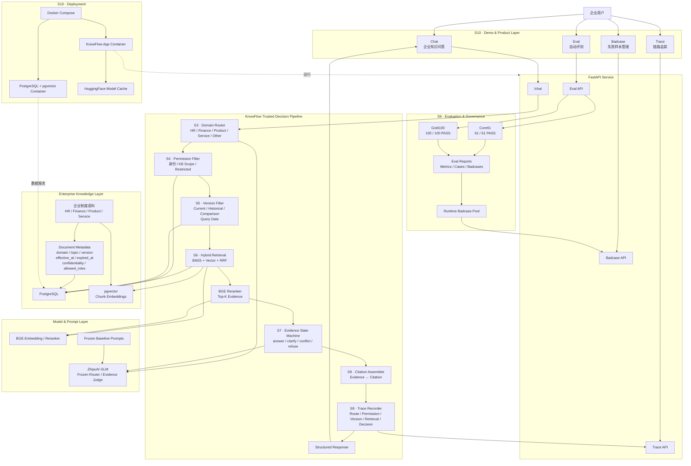

# KnowFlow 最终系统架构

## 1. 项目定位

KnowFlow 是一个面向企业内部知识查询、流程答疑和知识治理场景的可信知识协作 Agent。

系统不是单纯的“检索 + 大模型回答”，而是在回答前增加权限、版本、证据状态和冲突治理，使系统满足：

- 权限正确
- 版本正确
- 证据充分
- 冲突可见
- 无证据不强答
- 引用可追溯
- 全链路可评测

---

## 2. 系统总体架构



---

## 3. 核心业务链路

用户问题进入 KnowFlow 后，不直接发送给大模型生成答案，而是经过一条确定性的可信决策链：

```text
User Query
    ↓
Domain Router
    ↓
Permission Filter
    ↓
Version Filter
    ↓
Hybrid Retrieval
    ↓
Reranker
    ↓
Evidence State Machine
    ↓
Citation
    ↓
Trace
    ↓
Response
```

核心设计思想是：

> 先解决“能不能看、应该看哪个版本、证据是否足够”，再决定“能不能回答”。

---

## 4. 各层职责

### Domain Router

负责识别用户问题所属企业知识域：

- HR
- Finance
- Product
- Service
- Other

Router 只负责路由，不承担权限判断和答案生成。

### Permission Filter

权限判断发生在 Retrieval 之前。

对于 Restricted Finance 等受限知识：

```text
User
↓
Permission Check
↓
No Access
```

无权限用户不会进入私有知识检索，从数据链路层阻断信息泄漏。

### Version Filter

根据用户问题中的时间语义选择：

- Current
- Historical
- Comparison

并结合：

- `effective_at`
- `expired_at`
- `query_date`

执行文档级版本过滤。

### Hybrid Retrieval

检索流程：

```text
BM25 Top-N
+
Vector Top-N
↓
RRF Fusion
↓
BGE Reranker
↓
Top-K Evidence
```

只在 Permission + Version 已过滤后的文档集合内检索。

### Evidence State Machine

Evidence Judge 不直接回答业务问题，而是首先判断证据状态：

```text
answer
clarify
conflict
refuse
```

另外 Permission Layer 可以产生：

```text
no_access
```

从而把企业知识问答从简单的“有结果就回答”升级为证据状态驱动。

### Citation & Trace

Citation 建立：

```text
Answer / Decision
→ Evidence Chunk
→ Document
→ Version
```

Trace 保存完整链路：

```text
Query
Domain
Permission
Version
Retrieved Chunks
Rerank Scores
Decision
Citation
Latency
Token Usage
```

用于调试、审计和评测。

### Eval & Badcase

自动评测系统持续验证：

```text
Frozen Expected Behavior
vs
FastAPI Runtime Behavior
```

当前冻结结果：

- Core61：61 / 61 PASS
- Gold100：100 / 100 PASS
- Unauthorized Retrieval Rate：0.0
- Trace Persistence Rate：1.0
- Citation Alignment Rate：1.0

失败案例自动进入 Badcase Pool，用于后续归因和回归。

---

## 5. KnowFlow 与普通 RAG 的区别

普通 RAG 常见链路：

```text
Query
↓
Retrieve
↓
LLM
↓
Answer
```

KnowFlow：

```text
Query
↓
Domain
↓
Permission
↓
Version
↓
Scoped Retrieval
↓
Evidence State
↓
Citation
↓
Trace
↓
Answer / Clarify / Conflict / Refuse / No Access
```

KnowFlow 的重点不只是“找到答案”，而是确保：

> 在正确权限下，使用正确时间版本和足够证据，给出可追溯的企业知识响应。

---

## 6. 作品集展示重点

KnowFlow 最值得展示的三个治理案例：

### 权限治理

普通员工询问受限预算审批规则：

```text
Finance
→ Restricted
→ Permission Check
→ no_access
```

私有知识不会进入 Retrieval。

### 版本治理

不同查询日期命中不同制度版本：

```text
2026-04-30
→ Historical
→ V2.0

2026-05-01
→ Current
→ V2.1
```

版本选择由代码级日期规则完成，而不是让 LLM 猜测。

### 知识冲突治理

当前有效知识中出现两种住宿标准：

```text
500 元
vs
600 元
```

系统不强行选择其中一个，而是：

```text
decision = conflict
```

并保留对应 Citation 与 Trace。