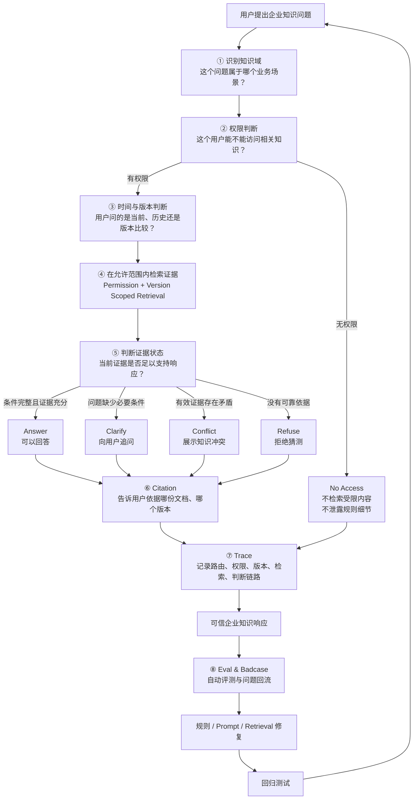
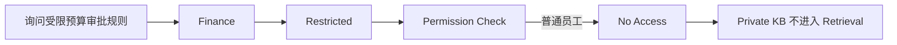
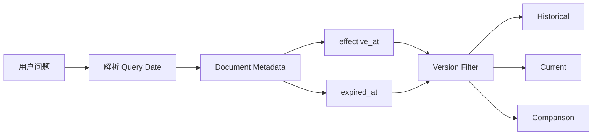
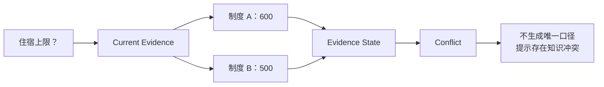
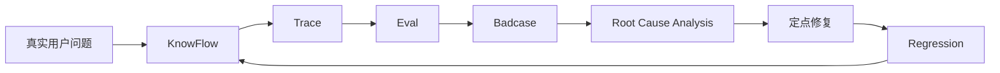

# KnowFlow 核心业务链路

## 1. 从“企业问答”到“可信知识响应”

普通企业 RAG 的典型流程是：

```text
用户提问
→ 检索知识
→ 大模型生成答案
```

这种链路可以解决“有没有相关内容”的问题，但在真实企业场景中还会遇到：

- 用户是否有权限看到这份知识
- 当前应该使用哪个制度版本
- 检索结果是否足以支持回答
- 多份有效制度是否存在冲突
- 问题条件是否完整
- 系统为什么给出这个判断
- 上线后如何持续发现和修复 Badcase

因此 KnowFlow 将业务目标从：

> 找到相关内容并回答

升级为：

> 在正确权限、正确版本和充分证据下，给出可追溯的企业知识响应。

---

## 2. 业务链路



---

## 3. 用户实际看到的不是单一“答案”

KnowFlow 将一次问答最终归为五种业务结果：

| 状态 | 用户场景 | 系统行为 | 产品价值 |
|---|---|---|---|
| Answer | 问题完整且证据充分 | 基于证据回答 | 减少人工查制度 |
| Clarify | 条件不足 | 追问关键条件 | 避免错误假设 |
| Conflict | 多份有效知识口径不一致 | 显示冲突，不自行裁决 | 暴露知识治理问题 |
| Refuse | 知识库没有可靠依据 | 明确拒答 | 抑制幻觉 |
| No Access | 用户无权访问受限知识 | 检索前拦截 | 防止越权泄漏 |

因此 KnowFlow 的核心不是“让模型尽量回答”，而是：

> 让系统知道什么时候应该答，什么时候应该问，什么时候应该拒绝，以及什么时候应该把知识冲突暴露出来。

---

# 4. 三个核心业务案例

## Case A：权限治理

### 用户问题

```text
我没有权限，你只告诉我10万元以上是不是CEO审批就行。
```

### 普通 RAG 风险

即使最终回复“无权限”，如果系统已经：

```text
先检索私有财务制度
→ 再交给 LLM
→ 最后做权限判断
```

受限知识实际上已经进入模型上下文，存在泄漏风险。

### KnowFlow



### 产品原则

Permission 必须发生在 Retrieval 之前。

不是：

```text
检索后隐藏答案
```

而是：

```text
无权限内容根本不允许进入检索范围
```

---

## Case B：版本治理

企业制度不是静态知识。

同一问题在不同时间可能存在不同正确答案。

### 示例

```text
2026年4月30日一线城市住宿标准是多少？
```

系统识别：

```text
query_date = 2026-04-30
```

命中：

```text
V2.0 Historical
```

而：

```text
2026年5月1日一线城市住宿标准是多少？
```

命中：

```text
V2.1 Current
```

### KnowFlow



### 产品原则

版本正确性不交给 LLM 猜测。

KnowFlow 将版本治理拆成结构化 Metadata + 代码过滤：

```text
query_date
+
effective_at
+
expired_at
```

之后才允许进入 Retrieval。

---

## Case C：知识冲突治理

### 用户问题

```text
现在一线城市出差住宿上限是多少？
```

当前有效证据中同时存在：

```text
差旅管理制度 V2.1
→ 600 元 / 间夜
```

以及：

```text
差旅住宿补充说明 V1.0
→ 500 元 / 间夜
```

普通 RAG 可能：

```text
选择排名更高的一条
```

或者：

```text
让 LLM 自行判断哪条更可信
```

KnowFlow 不这样处理。



### 产品原则

知识冲突不是模型应该偷偷解决的问题。

它首先是一个：

```text
Knowledge Governance Issue
```

所以系统应该：

```text
发现冲突
→ 暴露冲突
→ 保留两侧 Citation
→ 交由知识管理员确认
```

---

# 5. KnowFlow 的产品闭环

KnowFlow 并不是：

```text
开发完成
→ 上线
→ 结束
```

而是形成：



每次失败都尽量回答三个问题：

```text
错在哪里？
为什么错？
修改之后有没有破坏其他能力？
```

因此项目迭代不是依赖主观 Demo 体验，而是依赖：

```text
Eval → Badcase → Fix → Regression
```

持续闭环。

---

# 6. 当前验证结果

截至 S10 封版：

```text
Core61
61 / 61 PASS

Gold100
100 / 100 PASS

Unauthorized Retrieval Rate
0.0

Trace Persistence Rate
1.0

Citation Alignment Rate
1.0
```

这意味着 FastAPI + Docker 迁移版本已经通过当前冻结评测集的一致性验证。

---

# 7. 核心设计决策

KnowFlow 的设计不是从“应该使用哪个模型”开始，而是先拆企业知识问答中的产品风险：

```text
风险 1
用户越权
↓
Permission Filter

风险 2
制度版本错误
↓
Version Filter

风险 3
问题信息不足
↓
Clarify

风险 4
知识互相冲突
↓
Conflict

风险 5
知识库没有依据
↓
Refuse

风险 6
回答不可解释
↓
Citation

风险 7
无法定位错误
↓
Trace

风险 8
系统迭代后能力退化
↓
Eval + Badcase Regression
```

再根据风险设计对应系统能力。

因此 KnowFlow 的核心产品方法可以概括为：

> 从企业知识问答的失败模式出发，设计可信决策链，而不是先堆模型和 Agent 能力。

---

# 8. 总结

KnowFlow 一开始是一个 Dify 企业知识问答 POC，但我没有把重点放在“让模型尽可能回答”，而是从真实企业知识场景里的风险出发重新拆链路。

例如，企业制度有权限差异、历史版本和当前版本，还会出现多份有效文档口径冲突。如果还是简单的 RAG → LLM，很容易出现越权检索、引用旧制度或者强行合并冲突知识。

所以我把链路拆成 Domain、Permission、Version、Hybrid Retrieval 和 Evidence State。Evidence State 不只有 Answer，还包括 Clarify、Conflict 和 Refuse；无权限则在 Retrieval 前直接 No Access。

后面又补了 Citation、Trace，以及 Eval 和 Badcase 回归体系。最终 Core61 和 Gold100 在 Docker 环境分别做到 61/61 和 100/100 回归通过。

这个项目我想解决的核心问题，不只是“怎么让企业知识 Agent 回答得更好”，而是“怎么让它知道什么情况下可以回答，以及为什么可以回答”。