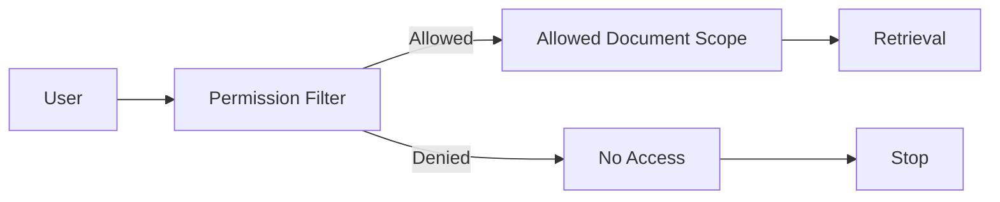
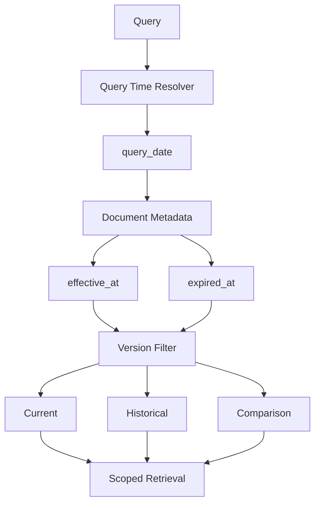
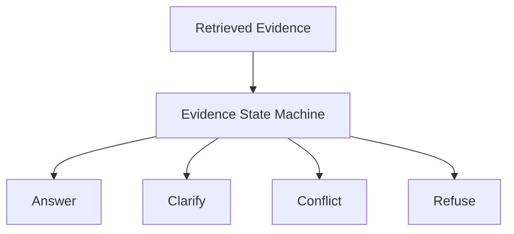
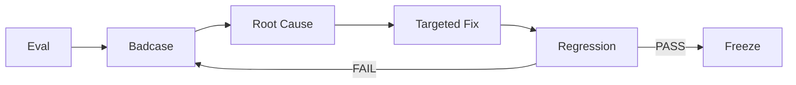

# KnowFlow 可信 RAG 机制

## 1. 为什么普通 RAG 还不够

普通企业 RAG 通常采用：

```text
Query
↓
Retrieve
↓
LLM
↓
Answer
```

这种架构擅长解决：

> “知识库里有没有和问题相关的内容？”

但企业知识问答真正面临的不只有相关性问题，还包括：

- 用户是否有权限访问相关知识
- 检索到的是不是当前正确版本
- 用户的问题条件是否完整
- 多份有效知识是否互相冲突
- 当前证据是否真的支持回答
- 回答依据能否追溯
- 系统出错后能否定位原因
- 修复一个问题后是否引入新的回归

因此 KnowFlow 没有把“可信”理解成单纯提高模型准确率，而是将可信拆解为一组可以被系统约束和验证的能力。

---

# 2. KnowFlow 的可信 RAG 模型

```mermaid
flowchart LR

    Q["User Query"]

    Q --> P["Permission Correctness"]
    P --> V["Version Correctness"]
    V --> R["Retrieval Correctness"]
    R --> E["Evidence Sufficiency"]
    E --> C["Citation Traceability"]
    C --> T["Decision Traceability"]
    T --> G["Regression Governance"]

    G --> O["Trusted Response"]
```



KnowFlow 将“可信”拆成七层：

```text
权限正确
+
版本正确
+
检索范围正确
+
证据状态正确
+
引用可追溯
+
决策可追溯
+
能力可回归验证
```

只有这些条件逐层满足后，系统才进入最终响应。

---

# 3. 普通 RAG 与 KnowFlow 对比

| 维度 | 普通 RAG | KnowFlow |
|---|---|---|
| 权限 | 检索后再考虑是否展示 | Retrieval 前完成权限过滤 |
| 版本 | 依赖检索排序或 LLM 判断 | Query Date + Metadata 代码过滤 |
| 检索范围 | 整个知识库召回 | Permission + Version Scoped Retrieval |
| 模糊问题 | 模型自行补全条件 | Clarify |
| 知识冲突 | 可能选择排名更高的一条 | Conflict |
| 无依据问题 | 容易产生推测 | Refuse |
| 受限问题 | 可能先读取再拒绝 | No Access，受限知识不进入 Retrieval |
| 引用 | 可能只有文本来源 | Chunk → Document → Version |
| 调试 | 主要查看最终回答 | 全链路 Trace |
| 迭代 | 靠人工体验 | Eval → Badcase → Fix → Regression |

KnowFlow 的核心变化不是增加更多 LLM，而是将回答之前的关键约束显式化。

---

# 4. 可信机制一：Permission-Aware Retrieval

## 风险

如果权限控制发生在 Retrieval 之后：

```text
Private Knowledge
↓
Retrieved
↓
LLM Context
↓
Permission Check
↓
拒绝展示
```

即使最终没有把答案返回给用户，受限内容仍然已经进入模型上下文。

对于企业知识系统，这不是真正的权限隔离。

## KnowFlow



设计原则：

```text
Permission
必须发生在
Retrieval 之前
```

无权限用户：

```text
Private Document
不会加载
不会检索
不会进入 Reranker
不会进入 Evidence Judge
不会进入 LLM Context
```

### 产品价值

权限控制从：

```text
回答层控制
```

升级为：

```text
数据访问层控制
```

---

# 5. 可信机制二：Version-Aware Retrieval

企业知识具有明显的时间属性。

例如：

```text
V2.0
effective_at = 2025-06-01
expired_at   = 2026-04-30

V2.1
effective_at = 2026-05-01
```

用户问：

```text
2026年4月30日一线城市住宿标准是多少？
```

与：

```text
2026年5月1日一线城市住宿标准是多少？
```

正确答案可能完全不同。

如果仅依赖向量相似度，两份制度可能都会被召回。

## KnowFlow



设计原则：

> Version 决策发生在 Retrieval 前，而不是检索完后让 LLM 判断哪一份更“像当前版本”。

### 产品价值

将：

```text
语义猜测
```

转化为：

```text
结构化 Metadata + 确定性规则
```

---

# 6. 可信机制三：Evidence State

普通 RAG 往往只有两种状态：

```text
找到内容
→ Answer

没找到内容
→ 可能仍然 Answer
```

KnowFlow 将 Evidence State 显式拆成：



另外 Permission Layer 可以直接产生：

```text
No Access
```

最终形成五种用户级响应状态。

### Answer

条件完整，并且证据足够支撑回答。

### Clarify

问题缺少决定答案的必要条件。

例如：

```text
试用期多久？
```

当前证据同时存在：

```text
社会招聘：3个月
校园招聘：6个月
```

因此系统不应该任选一个，而应该追问：

```text
请问您想了解社会招聘还是校园招聘员工？
```

### Conflict

多份当前有效知识对同一事实给出不同口径。

例如：

```text
一线城市住宿上限
600 元
vs
500 元
```

系统输出：

```text
decision = conflict
```

而不是让 LLM 自行裁决。

### Refuse

知识库没有足够可靠的事实依据。

例如：

```text
公司明年会统一涨薪吗？
```

系统不根据已有 HR 制度进行推测。

### No Access

用户没有访问相关受限知识的权限。

该状态由 Permission Layer 产生，不需要调用受限知识 Retrieval。

---

# 7. 可信机制四：Citation

企业知识回答需要解决：

> “这个判断依据什么？”

KnowFlow Citation 不是简单返回文档名称，而是建立：

```text
Decision
↓
Evidence Chunk
↓
Document
↓
Version
↓
Section / Page
```

Citation 保留的关键字段包括：

```text
citation_id
chunk_id
document_id
title
version_no
section
page
original_text
```

因此用户或调试人员可以从一个回答反向追溯：

```text
为什么这样回答
↓
用了哪个 Chunk
↓
Chunk 属于哪份制度
↓
制度是什么版本
```

---

# 8. 可信机制五：Trace

Citation 回答：

```text
“用了什么证据？”
```

Trace 回答：

```text
“系统为什么走到了这个结果？”
```

一次 KnowFlow 请求可追踪：

```text
Query
↓
Domain
↓
Permission
↓
Version
↓
Allowed Documents
↓
Retrieved Chunks
↓
Rerank Scores
↓
Evidence Decision
↓
Citation
↓
Latency / Token Usage
```

因此出现 Badcase 时，可以判断问题到底发生在：

```text
Router
Permission
Version
Retrieval
Reranker
Evidence Judge
Citation
```

而不是只看到一句“模型答错了”。

---

# 9. 可信机制六：Eval & Badcase Regression

KnowFlow 不把一次 Demo 成功视为系统正确。

完整迭代闭环为：



每个 Badcase 都尽量区分：

```text
Routing Error
Version Error
Permission Error
Retrieval Error
Evidence Decision Error
Citation Error
Runtime Error
```

从而避免所有问题最后都归因于：

```text
“LLM 不够聪明”
```

---

# 10. 典型 Badcase：从失败到回归

KnowFlow 在迁移过程中曾出现过：

```text
试用期多久？
Expected:
clarify

Actual:
answer
```

通过 Trace 可以进一步发现：

```text
Domain = HR
Version = Current
Retrieval = 正常
Top Evidence = 正确

问题发生在：
Evidence Decision
```

因此修复目标不是改 Retrieval，而是修 Evidence State 的模糊条件判断。

修复完成后：

```text
Target Case PASS
↓
Core61 Regression
↓
Gold100 Regression
```

这样可以避免：

```text
修好了 A
却破坏了 B、C、D
```

---

# 11. KnowFlow 的可信设计原则

KnowFlow 最终形成四个优先级：

```text
安全性
>
正确性
>
覆盖率
>
回答完整度
```

也就是说：

如果：

```text
不知道
```

优先：

```text
Refuse
```

如果：

```text
条件不足
```

优先：

```text
Clarify
```

如果：

```text
知识冲突
```

优先：

```text
Conflict
```

如果：

```text
没有权限
```

直接：

```text
No Access
```

而不是为了提高“回答率”强行生成答案。

---

# 12. 当前可信性验证结果

截至 S10：

```text
Core61
61 / 61 PASS

Gold100
100 / 100 PASS

Unauthorized Retrieval Rate
0.0

Trace Persistence Rate
1.0

Citation Alignment Rate
1.0
```

其中：

```text
Unauthorized Retrieval Rate = 0.0
```

验证的是无权限内容未进入实际 Retrieval；

```text
Trace Persistence Rate = 1.0
```

验证的是请求链路能够持久化；

```text
Citation Alignment Rate = 1.0
```

验证的是 Citation 与实际 Evidence 保持一致。

---

# 13. 产品价值总结

KnowFlow 并没有试图解决：

> “如何让大模型什么都能回答？”

而是在解决：

> “企业知识 Agent 在什么情况下应该回答，以及如何证明这个回答值得信任？”

核心路径从：

```text
Retrieve
→ Generate
```

变成：

```text
Permission
→ Version
→ Retrieve
→ Judge
→ Cite
→ Trace
→ Evaluate
```

这使企业知识问答从一个生成式 Demo，逐步变成一个具有：

```text
访问治理
版本治理
证据治理
可追溯性
评测闭环
```

的可信知识系统。

---

# 14. 总结

KnowFlow 和普通 RAG 最大的区别在于，普通 RAG 更关注“有没有召回相关知识”，但企业场景还需要回答另外几个问题：这个用户有没有权限、制度版本是不是正确、证据是否真的足够，以及多份知识发生冲突时系统应该怎么办。

所以我没有直接继续堆模型，而是把可信性拆成 Permission、Version、Evidence State、Citation 和 Trace。

比如权限是在 Retrieval 之前做，不允许用户访问的知识根本不会进入模型上下文；版本通过 query date 和 effective/expired metadata 做代码过滤；Evidence State 则把结果拆成 Answer、Clarify、Conflict 和 Refuse，而不是强制所有请求都进入答案生成。

最后再通过 Eval、Badcase 和回归测试验证迁移有没有退化。目前 Docker 环境下 Core61 和 Gold100 分别完成 61/61 和 100/100 回归。

所以这个项目真正想解决的是：不仅让 Agent 找到知识，而是让它知道什么时候有资格回答、有什么证据回答，以及出了问题后怎么定位和修复。